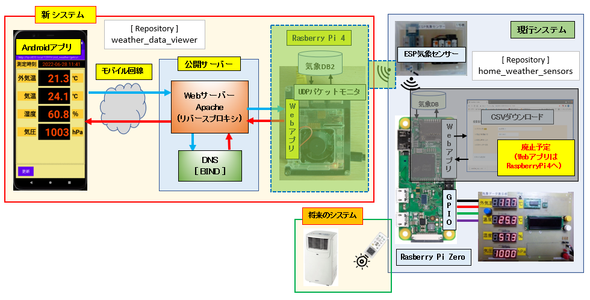

# IoT初歩の初歩 Androidアプリからラズパイに繫ぐ

外出先で Android スマホから自宅で稼働しているラズパイにアクセスし外気温・室内気温などの気象データを確認するシステムを構築

最終的には外気温・室内気温をみながら自宅のエアコンをオン・オフすることを目指します

## 1. IoTを実現するシステム全体像
<div>

</div>
<br/>

まずは Android スマホからモバイル回線を通してプライベートネットワーク内て稼働するラズパイにアクセスできる環境を作ります。

私はドメインを保有し自宅で公開サーバー (CentOS8-Stream) を運用しています。

現在グローバルIPアドレスの余裕が4つありラズパイ機にグローバルIPアドレスを割り当てし公開する方法も可能でしたが、ラズパイの能力からして十分なセキュリティ対策をとるのが難しいとの判断により、Apache サーバのリバースプロキシ機能を利用してインターネット越しにプライベートネットワーク内のラズパイにアクセスする方法を選択しました。

現行システムはプライベートネットワーク内で昨年の11月から稼働しており日々の気象センサーのデータはラズパイ内のデータベースに記録しています。

現行システムの概要とソースコードにつていは下記リポジトリにて公開済み

* **home_weather_sensors** リポジトリ: ESP気象センサー、気象センサーデータ保存・表示 (Python + **pigpio**)
* **plot_weather_flaskapp** リポジトリ: 気象センサーデータの可視化 Webアプリ (Flask + Vue.js 2)


## 2. ネームサーバーの設定

プライベートネットワーク内のサーバーに紐付けるサブドメイン用のCNAMEレコードを追加する必要があります  
※1. **ここに記載された公開ドメイン名、プロバイダのドメイン、IPアドレス等は全て架空です**  
※2. サンプルのドメインを **dreamexample.com** とします


[/var/named/dreamexample.com.zone] 説明用に "#"" でコメントを追記しています
```bash
#..一部省略...
          IN   NS  ns.dreamexample.com.           # 自ドメインのネームサーバー名
          IN   NS  awsome.internetproiver.com.    # プロバイダさんのネームサーバー
;
          IN   A   012.345.678.901
#..一部省略...
ns        IN   A   012.345.678.901
raspi       IN   CNAME   ns.dreamexample.com.      # ラズパイ向けのサブドメイン 
your1       IN   CNAME   ns.dreamexample.com.      # 検証用サーバー向けのサブドメイン
```


## 3. Webサーバによるリバースプロキシの構築

### 3-1. apache (httpd) によるリバースプロキシの設定

最低限必要なHTTPサーバーについての参考サイト  
https://www.netnea.com/cms/apache-tutorial-2_minimal-apache-configuration/  
**Configuring a Minimal Apache Web Server**  

本家サイトのドキュメント  
https://httpd.apache.org/docs/2.4/ja/logs.html  
ログファイル  
https://httpd.apache.org/docs/2.4/ja/howto/auth.html  
認証、承認、アクセス制御

当システムではWebサーバーとして動作させないため、それらに関わる設定は全て削除します  
**※ポートはデフォルトのポート80, 8080 を使用せず "12345" を使用します。**  

[/etc/httpd/conf/httpd.conf]  
```
Listen 12345

Include conf.modules.d/*.conf

User apache
Group apache

ServerAdmin root@localhost

LogLevel warn
ErrorLog "logs/error_log"
CustomLog "logs/access_log" combined

<IfModule log_config_module>
    LogFormat "%h %l %u %t \"%r\" %>s %b \"%{Referer}i\" \"%{User-Agent}i\"" combined
    LogFormat "%h %l %u %t \"%r\" %>s %b" common

    <IfModule logio_module>
      LogFormat "%h %l %u %t \"%r\" %>s %b \"%{Referer}i\" \"%{User-Agent}i\" %I %O" combinedio
    </IfModule>

</IfModule>

IncludeOptional conf.d/*.conf
```

リバースプロキシの設定  
https://httpd.apache.org/docs/2.4/mod/mod_proxy.html#proxypass  
**Apache モジュール mod_proxy**

ProxyPassMatchを使った場合の、ProxyPassReverseの書き方については下記
https://botproxy.net/docs/how-to/how-to-write-regex-for-apache-proxypassmatch-to-reverse-proxy-api-calls/  
**HOW TO WRITE REGEX FOR APACHE PROXYPASSMATCH TO REVERSE PROXY API CALLS**

Androidアプリからモバイル回線を通じてリクエストされるURLは下記２つあります。

名前付けルールは **get**XXXX**forpohne** のように "XXXX" 部分が処理名なるようにします  

```
http://[raspi|your1].dreamexample.com:12345/plot_weather/gettodayimageforphone
http://[raspi|your1].dreamexample.com:12345/plot_weather/getlastdataforphone
```  
そのままベタで書いても問題ありませんんが、後から URL が増えるとファイルの書き直しが発生してしまいます  
今回は**正規表現付きリバースプロキシ機能**を使用します

[/etc/httpd/conf.d/reverse_proxy.conf]  
(1) 検証サーバーにアクセスするリバースプロキシ設定
```
<VirtualHost *:12345>
   ServerName your1.dreamexample.com
   ProxyRequests Off

   ProxyPassMatch /plot_weather/get(.+?)forphone http://your1.local:12345/plot_weather/get$1forphone
   ProxyPassReverse /plot_weather/get(.+?)forphone http://your1.local:12345/plot_weather/get$1forphone
</VirtualHost>
```
(2) ラズパイ(本番環境)にアクセスするリバースプロキシ設定
```
<VirtualHost *:12345>
   ServerName raspi.dreamexample.com
   ProxyRequests Off

   ProxyPassMatch /plot_weather/get(.+?)forphone http://raspi-zero.local:12345/plot_weather/get$1forphone
   ProxyPassReverse /plot_weather/get(.+?)forphone http://raspi-zero.local:12345/plot_weather/get$1forphone
</VirtualHost>
```

必要なモジュール: httpdインストール時のオリジナルから編集した設定ファイル  
- 基本設定モジュール  
[conf.modules.d/00-base.conf]
```
LoadModule authn_core_module modules/mod_authn_core.so
LoadModule authz_core_module modules/mod_authz_core.so
LoadModule log_config_module modules/mod_log_config.so
LoadModule unixd_module modules/mod_unixd.so
```

※[注意] リバースプロキシのみの設定でも **authn_core_module, authz_core_module** は必要です  
このモジュールが無い場合、下記のようなエラーが error.log に出力されエラーレスポンスが返されます  
※見やすいよう改行をいれていますが実際は一行で出力されます
```
# cat /var/log/httpd/error_log | grep user
[Mon Jul 04 16:53:17.728715 2022] [core:crit] [pid 139919:tid 140394469705472]
 [client 123.456.789.012:40422] AH00025:
  configuration error:  couldn't check user: /plot_weather/getlastdataforphone
```

- リバースプロキシ関連モジュール  
[conf.modules.d/00-proxy.conf]
```
LoadModule proxy_module modules/mod_proxy.so
LoadModule proxy_http_module modules/mod_proxy_http.so
```
- 未編集のその他のモジュール設定ファイル
```
00-mpm.conf
00-systemd.conf
```

### 3-2. Webサーバのデフォルトポート以外のポートを利用する場合の設定

**SELinuxポリシーの設定が必要: ポート 12345 を追加**
```
# semanage port --add --type http_port_t --proto tcp 12345
# semanage port --list | grep http
...一部省略...
http_port_t      tcp      12345, 80, 81, 443, 488, 8008, 8009, 8443, 9000
```

### 3-3. httpdの起動

(1) 設定チェック: 下記のようにコンソールに出力されればOKです
```
# httpd -t
Syntax OK
```

(2) httpdサービスの有効化
```
# systemctl enable httpd.service 
Created symlink /etc/systemd/system/multi-user.target.wants/httpd.service → /usr/lib/systemd/system/httpd.service.
```

(3) httpdサービスの起動とステータスの確認
```
# systemctl start httpd.service 

# systemctl status httpd.service 
● httpd.service - The Apache HTTP Server
   Loaded: loaded (/usr/lib/systemd/system/httpd.service; enabled; vendor preset: disabled)
   Active: active (running) since Sun 2022-06-26 16:58:51 JST; 15s ago
     Docs: man:httpd.service(8)
 Main PID: 20247 (httpd)
   Status: "Running, listening on: port 12345"
    Tasks: 82 (limit: 24017)
   Memory: 15.1M
   CGroup: /system.slice/httpd.service
           ├─20247 /usr/sbin/httpd -DFOREGROUND
           ├─20248 /usr/sbin/httpd -DFOREGROUND
           ├─20249 /usr/sbin/httpd -DFOREGROUND
           └─20250 /usr/sbin/httpd -DFOREGROUND

 6月 26 16:58:51 localhost.dreamexample systemd[1]: Starting The Apache HTTP Server...
 6月 26 16:58:51 localhost.dreamexample systemd[1]: Started The Apache HTTP Server.
 6月 26 16:58:51 localhost.dreamexample httpd[20247]: Server configured, listening on: port 12345
```

### 3-4. WWWサービスに関するSELinux論理パラメータの設定

#### 3-4-1. 上記 2-3 での httpd 起動後、スマホからアクセスすると下記のエラーが発生しました
<div>

<br/>

(1) アクセスログ(/var/log/httpd/access_log)を確認  
※1. **IPアドレスは架空の値に加工しています**  
※2. ログは改行なしの一行ですが見やすくするため改行しています
```
123.456.789.012 - - [05/Jul/2022:14:52:09 +0900] 
"GET /plot_weather/getlastdataforphone HTTP/1.1" 503 299 "-" 
"Dalvik/2.1.0 (Linux; U; Android 12; Pixel 4a Build/SQ3A.220605.009.A1)"
```

(2) エラーログ(/var/log/httpd/error.log)を確認 ※1, ※2
```
[Tue Jul 05 14:52:09.626339 2022] [proxy:error] [pid 154164:tid 140162029844224]
 (13)Permission denied: AH00957: HTTP: attempt to connect to 192.168.0.101:12345 (*) failed
[Tue Jul 05 14:52:09.626393 2022] [proxy_http:error] [pid 154164:tid 140162029844224] 
[client 123.456.789.012:43036] AH01114: HTTP: failed to make connection to backend: your1.local
```

#### 2-4-2. 上記エラーの解決策については下記サイトを参考に対処  
https://unix.stackexchange.com/questions/174593/centos-7-httpd-failed-to-make-connection-with-backend  

http://sysadminsjourney.com/content/2010/02/01/apache-modproxy-error-13permission-denied-error-rhel/  
Apache Mod_proxy '[Error] (13)Permission Denied' Error on RHEL

```
 /usr/sbin/setsebool -P httpd_can_network_connect 1
```

* 上記 **"httpd_can_network_connect"** については下記書籍に日本語の説明があります  
**「CentOS8 で作るネットワークサーバ構築ガイド (CentOSLinux8 8.1[1911] x86_64対応」**  
秀和システム ISBN978-4-7980-6164-1  
**12.3.4 SELinux保護 Table 12.3 targetedポリシーのhttpdサービスに関するパラメータ**  

#### 2-4-3. SELinux論理パラメータ **httpd_can_network_connect** の有効化
```
# setsebool -P httpd_can_network_connect 1
# getsebool -a | grep "httpd_can_network_connect "
httpd_can_network_connect --> on
```

下記論理パラメータをoffに設定 ※リバーシプロキシーでは不要  
* **httpd_enable_cgi**: apache で cgi を提供しない
* **httpd_builtin_scripting**: apache で PHP などのスクリプトを提供しない
```
[root@localhost ~]# setsebool -P httpd_enable_cgi off
[root@localhost ~]# setsebool -P httpd_builtin_scripting off
[root@localhost ~]# getsebool httpd_can_network_connect httpd_builtin_scripting httpd_enable_cgi
httpd_can_network_connect --> on
httpd_builtin_scripting --> off
httpd_enable_cgi --> off
```


#### 3-4-4. apacheを再起動し、再度スマホからアクセス
```
# systemctl restart httpd.service
```

今度はデータが取得できました。
<div>

<br />

(1) アクセスログ(/var/log/httpd/access_log)を確認 ※1., ※2.
```
123.456.789.012 - - [05/Jul/2022:15:04:58 +0900]
"GET /plot_weather/getlastdataforphone HTTP/1.1" 200 146 "-"
"Dalvik/2.1.0 (Linux; U; Android 12; Pixel 4a Build/SQ3A.220605.009.A1)"
```

(2) サーバーサイド(Flaskアプリ)の出力ログ  
※1. ホスト名、トークン、IPアドレスは加工しています  
※2. **X-Forwarded-xxxヘッダー類は適切に設定されています**

```
~/webapp/logs/plotweather_202207051448.log
2022-07-05 15:04:58 DEBUG app_main.py(135)[getLastDataForPhone] getlastdataforphone()
2022-07-05 15:04:58 DEBUG app_main.py(137)[getLastDataForPhone] headers: 
Host: your1.local:12345
Content-Type: application/json;charset=utf8
Accept: application/json;
X-Request-Phone-Token: mvy... secrets.token_urlsafe(32) ...dyrw
X-Request-Network-Type: wifi
User-Agent: Dalvik/2.1.0 (Linux; U; Android 12; Pixel 4a Build/SQ3A.220605.009.A1)
Accept-Encoding: gzip
X-Forwarded-For: 123.456.789.012
X-Forwarded-Host: your1.dreamexample.com:12345
X-Forwarded-Server: your1.dreamexample.com
Connection: close

2022-07-05 15:04:58 DEBUG weatherdao.py(101)[getLastData] 
row: (1656999898, '2022-07-05 14:44', 28.5, 28.7, 58.3, 1004.2)
2022-07-05 15:04:58 DEBUG app_main.py(40)[close_conn] db:<sqlite3.Connection object at 0x7fa5c1f7d570>
```
<br/>

## Androidアプリの画面イメージ

* 左側画面: 最新データ表示画面 ※気象データベースの最終レコード
* 右側画面: 当日データグラフ表示画面
<div>

<br />

[**>>> Androidアプリの作成 ページへ <<<** ](android/README.md)
