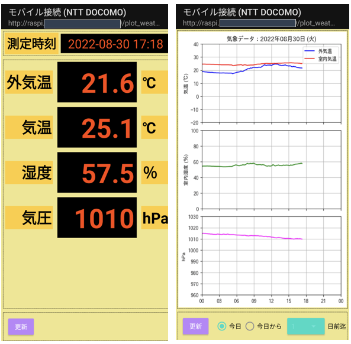
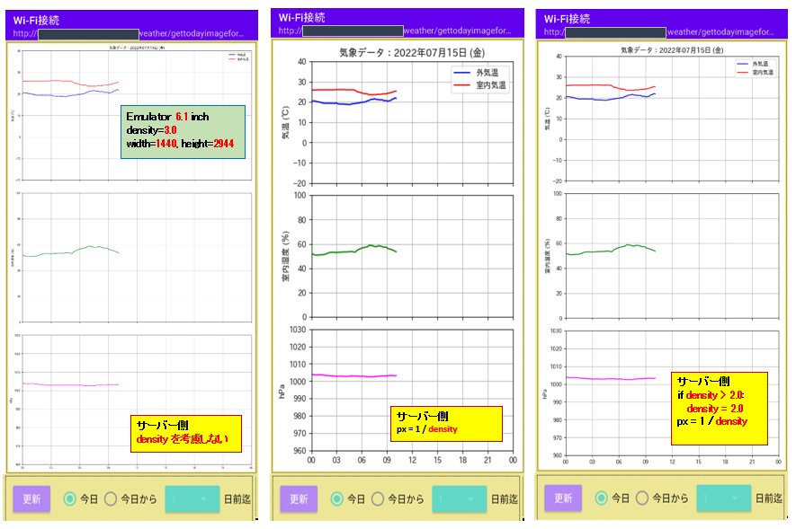

## 1. Androidアプリの作成

### 1-0. 画面イメージ

* 最新データ表示画面 (左) と当日データグラフ画面 (右)
* 左右のスワイプ操作で画面を切り替えします
<div>

<br />

* 今日から(1, 2, 3, 7)日 前迄の期間グラフも表示
* 数日前からの気圧の上がり下がりがわかるので天気が良くなるのか悪くなるのかの目安になります

<div>

<br />

左側の画面は下の「気象データ表示板」を模したものです。
<div>

<br /><br/>

### 1-1. プロジェクトの作成

プロジェクトウィザードで New Project を選択し下記設定でアプリケーションプロジェクトを作成します
*  Fragment + ViewModel  
※ Fragment + ViewModel を選択しましたが、**ViewModelは使わず Fragmentのみを使用します**
*  Package name: **com.dreamexample**.android.weatherdataviewer **※架空ドメインとしています**
* Langage: Java
* Minimum SDK: API 26: Android 8.0 (Oreo) 

#### 1-1-1. プロジェクトレベルのビルド設定ファイル

 [builid.gradle] 

* 作成直後
```gradle
// Top-level build file where you can add configuration options common to all sub-projects/modules.
plugins {
    id 'com.android.application' version '7.2.1' apply false
    id 'com.android.library' version '7.2.1' apply false
}

task clean(type: Delete) {
    delete rootProject.buildDir
}
```

*修正: **Google の Jsonライブラリ(Gson)を使用するので googleリポジトリを追加**
```gradle
// Top-level build file where you can add configuration options common to all sub-projects/modules.
buildscript {       // +
    repositories {  // +
        google()    // + 追加
    }               // +
}                   // +

plugins {
    id 'com.android.application' version '7.2.1' apply false
    id 'com.android.library' version '7.2.1' apply false
}

task clean(type: Delete) {
    delete rootProject.buildDir
}
```

#### 1-1-2. アプリケーションレベルのビルド設定ファイル

 [app/builid.gradle] 
* 作成直後: **ViewModelを使わないので関連する依存を削除する**
```gradle
plugins {
    id 'com.android.application'
}

android {
    compileSdk 32

    defaultConfig {
        applicationId "com.dreamexample.android.weatherdataviewer"
        minSdk 26
        targetSdk 32
        versionCode 1
        versionName "1.0"

        testInstrumentationRunner "androidx.test.runner.AndroidJUnitRunner"
    }

    buildTypes {
        release {
            minifyEnabled false
            proguardFiles getDefaultProguardFile('proguard-android-optimize.txt'), 'proguard-rules.pro'
        }
    }
    compileOptions {
        sourceCompatibility JavaVersion.VERSION_1_8
        targetCompatibility JavaVersion.VERSION_1_8
    }
}

dependencies {

    implementation 'androidx.appcompat:appcompat:1.4.2'
    implementation 'androidx.constraintlayout:constraintlayout:2.1.4'
    implementation 'com.google.android.material:material:1.6.1'
    implementation 'androidx.lifecycle:lifecycle-livedata-ktx:2.5.0'    // - 削除
    implementation 'androidx.lifecycle:lifecycle-viewmodel-ktx:2.5.0'   // - 削除
    testImplementation 'junit:junit:4.13.2'
    androidTestImplementation 'androidx.test.ext:junit:1.1.3'
    androidTestImplementation 'androidx.test.espresso:espresso-core:3.4.0'
}
```

* 修正後
  * **targetSdk: 27** に変更 ※targetSdk>=28 でHTTP通信がエラーになる  
https://developer.android.com/training/articles/security-config?hl=ja#CleartextTrafficPermitted    
**Android 9（API レベル 28）以上では、クリアテキストのサポートがデフォルトで無効になっています**  
※ targetSdk=27 でもAndroid12の端末にインストール可能 
  * **ViewPager2** を使用するので依存を追加
  * assetsディレクトリ追加: サーバーへのリクエストURL(Json)ファイルを格納
```gradle
plugins {
    id 'com.android.application'
}

android {
    compileSdk 32

    defaultConfig {
        applicationId "com.dreamexample.android.weatherdataviewer"
        minSdk 26
        targetSdk 27
        versionCode 1
        versionName "1.0"

        testInstrumentationRunner "androidx.test.runner.AndroidJUnitRunner"
    }

    buildTypes {
        release {
            minifyEnabled true
            proguardFiles getDefaultProguardFile('proguard-android-optimize.txt'), 'proguard-rules.pro'
        }

        debug {                            // +
            applicationIdSuffix ".debug"   // +
            debuggable true                // +
        }                                  // +

        staging {                                                 // +
            initWith debug                                        // +
            manifestPlaceholders = [hostname:"com.dreamexample"]  // +
            applicationIdSuffix ".debugStagint"                   // +
        }                                                         // +
    }
    compileOptions {
        sourceCompatibility JavaVersion.VERSION_1_8
        targetCompatibility JavaVersion.VERSION_1_8
    }
    sourceSets {                             // +              
        main {                               // +
            assets {                         // +
                srcDirs 'src/main/assets'    // +
            }                                // +
        }                                    // +
    }
}

dependencies {
    implementation 'com.google.code.gson:gson:2.9.0'      // + 追加

    implementation 'androidx.appcompat:appcompat:1.4.2'
    implementation 'androidx.constraintlayout:constraintlayout:2.1.4'
    implementation 'com.google.android.material:material:1.6.1'
    implementation 'androidx.viewpager2:viewpager2:1.0.0'            // + 追加
    testImplementation 'junit:junit:4.13.2'
    androidTestImplementation 'androidx.test.ext:junit:1.1.3'
    androidTestImplementation 'androidx.test.espresso:espresso-core:3.4.0'
}
```

**[ targetSdkバージョンによる HTTP通信 NG / OK の比較 ] ※実機 Pixel4a (Android12) で確認**

[logcat] 左側エラー画面時の出力ログ
```
W/WeatherRepository: Cleartext HTTP traffic to xxxxxx.local not permitted
```

<div>

<br /><br />


#### 1-1-3. マニュフェストファイル

* activity Tag
  * android:**screenOrientation**: 縦画面のみ  
    ※端末を回転させても画面は縦画面のまま

 [app/src/main/AndroidManifest.xml] 
```xml
<manifest xmlns:android="http://schemas.android.com/apk/res/android"
    xmlns:tools="http://schemas.android.com/tools"
    package="com.dreamexample.android.weatherdataviewer">

    <uses-permission android:name="android.permission.INTERNET" />
    <uses-permission android:name="android.permission.ACCESS_NETWORK_STATE" />  <!-- Mobile/Wi-fi判定 -->

    <application
        android:name=".WeatherApplication"
        android:allowBackup="true"
        android:dataExtractionRules="@xml/data_extraction_rules"
        android:fullBackupContent="@xml/backup_rules"
        android:icon="@mipmap/ic_launcher"
        android:label="@string/app_name"
        android:roundIcon="@mipmap/ic_launcher_round"
        android:supportsRtl="true"
        android:theme="@style/Theme.WeatherDataViewer"
        tools:targetApi="31">
        <activity
            android:name=".MainActivity"
            android:screenOrientation="portrait"
            android:exported="true">
            <intent-filter>
                <action android:name="android.intent.action.MAIN" />

                <category android:name="android.intent.category.LAUNCHER" />
            </intent-filter>
        </activity>
    </application>

</manifest>
```
<br />

### 1-2. 画面作成

#### 1-2-1. 最新データ取得フラグメントのレイアウト

* 画面は比較的簡単な構造なのでFragmentのコンテナとして LinearLayout を使用 
  * 測定時刻部分、更新ボタン部分は
  * データ表示部分はテーブル構造のため**コンテナとして TableLayout を使用する**

※FAB (Floating Action Button) はアクティビティに属するのでフラグメントには現れません

<div>

<br /><br />

プロジェクト生成時の下記ファイル[fragment_mailn] をコピーし、データ取得画面用のファイルを作成  
**※レイアウト ConstraintLayout は使用しません**  

[res/layout/fragment_main.xml]
```xml
<androidx.constraintlayout.widget.ConstraintLayout xmlns:android="http://schemas.android.com/apk/res/android"
    xmlns:app="http://schemas.android.com/apk/res-auto"
    xmlns:tools="http://schemas.android.com/tools"
    android:id="@+id/main"
    android:layout_width="match_parent"
    android:layout_height="match_parent"
    tools:context=".ui.main.MainFragment">

    <TextView
        android:id="@+id/message"
        android:layout_width="wrap_content"
        android:layout_height="wrap_content"
        android:text="MainFragment"
        app:layout_constraintBottom_toBottomOf="parent"
        app:layout_constraintEnd_toEndOf="parent"
        app:layout_constraintStart_toStartOf="parent"
        app:layout_constraintTop_toTopOf="parent" />

</androidx.constraintlayout.widget.ConstraintLayout>
```

ウィジットのスタイルをスタイル定義ファイルに記述し、画面のウィジットから分離します。  

[res/values/styles.xml]
```xml
<resources>
    <style name="StyleDataBase" parent="android:Widget.TextView">
        <item name="android:layout_width">wrap_content</item>
        <item name="android:layout_height">wrap_content</item>
        <item name="android:textAppearance">@style/TextAppearance.AppCompat.Display1</item>
        <item name="android:textStyle">bold</item>
    </style>
    <!-- データ値のスタイル -->
    <style name="StyleDataValue" parent="StyleDataBase">
        <item name="android:layout_width">0dp</item>
        <item name="android:layout_weight">1</item>
        <item name="android:layout_margin">@dimen/value_layout_margin</item>
        <item name="android:padding">@dimen/value_padding</item>
        <item name="android:paddingRight">@dimen/value_padding_right</item>
        <item name="android:gravity">right|center_vertical</item>
        <item name="android:text">@string/init_measurement_value</item>
        <item name="android:textSize">@dimen/value_font_size</item>
        <item name="android:textColor">@color/orange_red</item>
        <item name="android:background">@android:color/black</item>
    </style>
    <style name="StyleDataLabelBase" parent="StyleDataBase">
        <item name="android:padding">@dimen/label_padding</item>
        <item name="android:textColor">@android:color/black</item>
        <item name="android:background">@color/yellow_dark</item>
    </style>
    <!-- 測定時刻ラベルのスタイル -->
    <style name="StyleMesurementTimeTitle" parent="StyleDataLabelBase">
        <item name="android:padding">@dimen/value_padding</item>
        <item name="android:textSize">@dimen/label_measurement_font_size</item>
    </style>
    <!-- 測定時刻値のスタイル -->
    <style name="StyleMesurementTimeValue" parent="android:Widget.TextView">
        <item name="android:layout_width">0dp</item>
        <item name="android:layout_height">wrap_content</item>
        <item name="android:layout_weight">1</item>
        <item name="android:layout_marginLeft">@dimen/fotter_margin_left</item>
        <item name="android:padding">@dimen/label_padding</item>
        <item name="android:gravity">center</item>
        <item name="android:textAppearance">@style/TextAppearance.AppCompat.Display1</item>
        <item name="android:textColor">@color/orange_red</item>
        <item name="android:textSize">@dimen/label_measurement_font_size</item>
        <item name="android:background">@color/black</item>
    </style>
    <!-- データラベルのスタイル -->
    <style name="StyleDataLabelName" parent="StyleDataLabelBase">
        <item name="android:layout_margin">@dimen/value_layout_margin</item>
        <item name="android:gravity">right|center_vertical</item>
    </style>
    <!-- 単位テキストのスタイル -->
    <style name="StyleDataUnitName" parent="StyleDataLabelBase">
        <item name="android:layout_margin">@dimen/value_layout_margin</item>
        <item name="android:gravity">left|center_vertical</item>
    </style>
    <!-- エラーメッセージテキストのスタイル -->
    <style name="StyleResponseStatus" parent="android:Widget.TextView">
        <item name="android:layout_width">match_parent</item>
        <item name="android:layout_height">wrap_content</item>
        <item name="android:layout_margin">@dimen/value_layout_margin</item>
        <item name="android:padding">@dimen/value_padding</item>
        <item name="android:textAppearance">@android:style/TextAppearance.Large</item>
        <item name="android:textColor">@color/red</item>
        <item name="android:background">@drawable/frame_background_white</item>
    </style>
    <!-- 更新ボタンコンテナのスタイル -->
    <style name="StytleButtonContainer">
        <item name="android:layout_width">match_parent</item>
        <item name="android:layout_height">wrap_content</item>
        <item name="android:orientation">horizontal</item>>
        <item name="android:layout_margin">@dimen/frame_margin</item>
        <item name="android:padding">@dimen/label_padding</item>
        <item name="android:background">@drawable/frame_background</item>
    </style>
    <!-- 更新ボタンのスタイル -->
    <style name="StyleButtonUpdate" parent="android:Widget.Material.Button.Colored">
        <item name="android:layout_width">wrap_content</item>
        <item name="android:layout_height">wrap_content</item>
        <item name="android:layout_margin">@dimen/left_button_margin</item>
        <item name="android:padding">@dimen/label_padding</item>>
        <item name="android:textAppearance">@android:style/TextAppearance.Large</item>
        <item name="android:textColor">@android:color/white</item>
    </style>
    <!-- ラジオボタンのスタイル -->
    <style name="StyleRadio">
        <item name="android:layout_width">wrap_content</item>
        <item name="android:layout_height">@dimen/todays_item_height</item>
        <item name="android:layout_marginEnd">3dp</item>>
        <item name="android:textAppearance">@android:style/TextAppearance.Small</item>
        <item name="android:textColor">@android:color/black</item>
    </style>
</resources>
```

最新データ表示画面のレイアウトファイル  
※体裁はスタイルファイルの変更で済むので画面管理が容易になります。

[res/layout/fragment_today_data.xml]
```xml
<LinearLayout xmlns:android="http://schemas.android.com/apk/res/android"
    xmlns:tools="http://schemas.android.com/tools"
    android:layout_width="match_parent"
    android:layout_height="match_parent"
    android:orientation="vertical"
    android:background="@color/khaki"
    tools:context=".MainActivity">

    <LinearLayout
        android:layout_width="match_parent"
        android:layout_height="wrap_content"
        android:layout_margin="@dimen/frame_margin"
        android:layout_marginBottom="0dp"
        android:padding="4dp"
        android:orientation="horizontal"
        android:background="@drawable/frame_background">
        <TextView
            android:text="@string/lbl_mesurement_time"
            style="@style/StyleMesurementTimeTitle"/>
        <TextView
            android:id="@+id/valMeasurementDatetime"
            android:text="@string/init_measurement_time"
            style="@style/StyleMesurementTimeValue"/>
    </LinearLayout>

    <TableLayout
        android:layout_width="match_parent"
        android:layout_height="0dp"
        android:layout_margin="@dimen/frame_margin"
        android:layout_marginBottom="0dp"
        android:layout_weight="1"
        android:background="@drawable/frame_background">

        <TableRow android:gravity="center_vertical">
            <TextView
                android:text="@string/lbl_temp_out"
                style="@style/StyleDataLabelName"/>
            <TextView
                android:id="@+id/valTempOut"
                style="@style/StyleDataValue" />
            <TextView
                android:text="@string/fotter_lbl_doci"
                style="@style/StyleDataUnitName"/>
        </TableRow>

        <TableRow android:gravity="center_vertical">
            <TextView
                android:text="@string/lbl_temp_in"
                style="@style/StyleDataLabelName"/>
            <TextView
                android:id="@+id/valTempin"
                style="@style/StyleDataValue"/>
            <TextView
                android:text="@string/fotter_lbl_doci"
                style="@style/StyleDataUnitName"/>
        </TableRow>

        <TableRow android:gravity="center_vertical">
            <TextView
                android:text="@string/lbl_humid"
                style="@style/StyleDataLabelName"/>
            <TextView
                android:id="@+id/valHumid"
                style="@style/StyleDataValue"/>
            <TextView
                android:text="@string/fotter_lbl_percent"
                style="@style/StyleDataUnitName"/>
        </TableRow>

        <TableRow android:gravity="center_vertical">
            <TextView
                android:text="@string/lbl_pressure"
                style="@style/StyleDataLabelName"/>
            <TextView
                android:id="@+id/valPressure"
                style="@style/StyleDataValue"/>
            <TextView
                android:text="@string/fotter_lbl_pressure"
                style="@style/StyleDataUnitName"/>
        </TableRow>

        <TableRow
            android:id="@+id/messageRow"
            android:visibility="gone">
            <TextView
                android:id="@+id/valResponseStatus"
                android:layout_span="3"
                android:layout_weight="1"
                style="@style/StyleResponseStatus"/>
        </TableRow>
    </TableLayout>

    <LinearLayout
        style="@style/StytleButtonContainer">
        <Button
            android:id="@+id/btnUpdate"
            android:text="@string/lbl_btn_update"
            style="@style/StyleButtonUpdate"/>
    </LinearLayout>
</LinearLayout>
```

#### 1-2-2. ActivityのViewPager2定義

* References ViewPager2
    * https://developer.android.com/training/animation/screen-slide-2?hl=ja  
    **ViewPager2 を使用してフラグメント間をスライドする** 
    * https://medium.com/@huseyinozkoc/hello-welcome-to-my-article-dear-android-developers-and-dear-fox-a4c483f8a4ac  
    **How can we use ViewPager2 basically?**  

[res/layout/activity_main.xml]
```xml
<androidx.coordinatorlayout.widget.CoordinatorLayout
    xmlns:android="http://schemas.android.com/apk/res/android"
    xmlns:app="http://schemas.android.com/apk/res-auto"
    xmlns:tools="http://schemas.android.com/tools"
    android:layout_width="match_parent"
    android:layout_height="match_parent"
    tools:context=".MainActivity">

    <androidx.viewpager2.widget.ViewPager2
        android:id="@+id/pager"
        android:layout_width="match_parent"
        android:layout_height="match_parent"
        app:layout_constraintBottom_toBottomOf="parent"
        app:layout_constraintEnd_toEndOf="parent"
        app:layout_constraintEnd_toStartOf="parent"
        app:layout_constraintTop_toTopOf="parent">
    </androidx.viewpager2.widget.ViewPager2>

</androidx.coordinatorlayout.widget.CoordinatorLayout>```

### 2-1. データクラスの実装

#### 2-1-0. サーバー側が出力するデータ(JSON)の確認

* (1) 最新データ取得リクエストパス: /plot_weather/getlastdataforphone  
  [必須ヘッダー] X-Request-Phone-Token

```bash
$ curl http://your1.dreamexample.com:12345/plot_weather/getlastdataforphone \
   -H "X-Request-Phone-Token:mvyx16uEZ8Upm1Vs2PJENP... secrets.token_urlsafe(32) ...jGvXRbDB6QHu0V9tAPxI2GJQatCdyrw" | json_pp
  % Total    % Received % Xferd  Average Speed   Time    Time     Time  Current
                                 Dload  Upload   Total   Spent    Left  Speed
100   146  100   146    0     0  18250      0 --:--:-- --:--:-- --:--:-- 18250
{
   "data" : {
      "pressure" : 1005.9,
      "humid" : 52.9,
      "temp_out" : 25,
      "measurement_time" : "2022-07-11 15:21",
      "temp_in" : 28.8
   },
   "status" : {
      "code" : 0,
      "message" : "OK"
   }
}
```

* (2) 当日データグラフ取得リクエストパス: /plot_weather/gettodayimageforphone  
  [必須ヘッダー] X-Request-Phone-Token, X-Request-Image-Size  
  ※"img_src": 画像の出力サイズが大きいため大部分省略して説明を付け加えています

```bash
  $ curl http://your1.dreamexample.com:12345/plot_weather/gettodayimageforphone \
   -H "X-Request-Phone-Token:mvyx16uEZ8Upm1Vs2PJENP... secrets.token_urlsafe(32) ...jGvXRbDB6QHu0V9tAPxI2GJQatCdyrw" \
   -H "X-Request-Image-Size: 164x176" | json_pp -f json
  % Total    % Received % Xferd  Average Speed   Time    Time     Time  Current
                                 Dload  Upload   Total   Spent    Left  Speed
100 20553  100 20553    0     0  25003      0 --:--:-- --:--:-- --:--:-- 25003
{
   "data" : {
      "img_src" : "data:image/png;base64,iVBORw0...(画像データのbase64文字列)...RK5CYII="
   },
   "status" : {
      "message" : "OK",
      "code" : 0
   }
}
```

References Google Gson (JsonデータをJavaクラスに変換するGsonライブラリ)  
https://sites.google.com/site/gson/gson-user-guide  
**Gson User Guide**

#### 2-1-1. データ("data")取得クラス 

(1) 最新データ取得のデータ("data")クラス  

[com/dreamexample/android/weatherdataviewer/data/ResponseData.java]
```java
import com.google.gson.annotations.SerializedName;

public class ResponseData {

    @SerializedName("measurement_time")
    private final String measurementTime;
    @SerializedName("temp_out")
    private final double tempOut;
    @SerializedName("temp_in")
    private final double tempIn;
    private final double humid;
    private final double pressure;

    public ResponseData(String measurementTime, double tempOut, double tempIn, double humid, double pressure) {
        this.measurementTime = measurementTime;
        this.tempOut = tempOut;
        this.tempIn = tempIn;
        this.humid = humid;
        this.pressure = pressure;
    }
    // ... Getter, toString 省略 ...
```

(2) 当日データグラフ取得のデータ("data")クラス

[com/dreamexample/android/weatherdataviewer/data/ResponseGraph.java]
```java
import com.google.gson.annotations.SerializedName;

public class ResponseGraph {
    @SerializedName("img_src")
    private final String imgSrc;

    public ResponseGraph(String imgSrc) {
        this.imgSrc = imgSrc;
    }
    // ... Getter, toString 省略 ...
```

#### 2-1-2. 各データのステータス("status")クラス

[com/dreamexample/android/weatherdataviewer/data/ResponseStatus.java]
```java
public class ResponseStatus {
    private final int code;
    private final String message;

    public ResponseStatus(int code, String message) {
        this.code = code;
        this.message = message;
    }
    // ... Getter, toString 省略 ...
```

#### 2-2-1. 最新データ取得クラス

[com/dreamexample/android/weatherdataviewer/data/ResponseDataResult.java]
```java
public class ResponseDataResult {
    private final ResponseData data;
    private final ResponseStatus status;

    public ResponseDataResult(ResponseData data, ResponseStatus status) {
        this.data = data;
        this.status = status;
    }
    // ... Getter, toString 省略 ...
```

#### 2-2-2. 当日データグラフ取得クラス

* getImageBytesメソッドで画像のBase64文字列をデコードしたバイトを返却します  
※ "img_src": **"data:image/png;base64"の部分は取り除きます**

[com/dreamexample/android/weatherdataviewer/data/ResponseGraphResult.java]
```java
import android.util.Log;
import java.util.Base64;

public class ResponseGraphResult {
    private final ResponseGraph data;
    private final ResponseStatus status;

    public ResponseGraphResult(ResponseGraph data, ResponseStatus status) {
        this.data = data;
        this.status = status;
    }

    public byte[] getImageBytes() {
        if (data != null) {
            // img_src = "data:image/png;base64, ..base64string..."
            String[] datas = data.getImgSrc().split(",");
            Log.d("ResponseGraphResult", "datas[0]" + datas[0]);
            return Base64.getDecoder().decode(datas[1]);
        } else {
            return null;
        }
    }
    // ... 一部のGetter, toString 省略 ...
```

### 2-3. バッググラウンドスレッドを利用したデータ取得

* **AsyncTask クラスが Android-11 (API 30) で deprecated になりました**  
https://developer.android.com/reference/android/os/AsyncTask  
**AsyncTask**
```
This class was deprecated in API level 30.
Use the standard java.util.concurrent or Kotlin concurrency utilities instead.
```

* 代替策の概要と実装例が本家サイトの下記ドキュメントに載っています  
https://developer.android.com/guide/background/threading  
**バックグラウンド スレッドでの Android タスクの実行**  
※上記サイトの代替策の実装をほぼそのままを当アプリに合わせて実装します

#### 2-3-1. カスタムApplicationクラス

* ExecutorService インターフェースと、Handler を保持する
  * **public ExecutorService mEexecutor** = Executors.newFixedThreadPool(1);  
     ※アプリが連続して複数のリクエストを発行することはないためスレッドプールを1とする
  * **public Handler mdHandler** = HandlerCompat.createAsync(Looper.getMainLooper());
* Assets にあるリクエスト情報ファイル("request_info.json")を読み込みGsonでJavaのMapに変換する  
Implementation Reference  
https://www.baeldung.com/gson-json-to-map  
**Convert JSON to a Map Using Gson**

[app/src/main/assets/request_info.json]
```json
{
  "urls": {
    "wifi": "http://your1.local:12345/plot_weather",
    "mobile": "http://your1.dreamexample.com:12345/plot_weather"
  },
  "headers": {
    "X-Request-Phone-Token": "mvyx16uEZ8Upm1Vs2PJENP... secrets.token_urlsafe(32) ...jGvXRbDB6QHu0V9tAPxI2GJQatCdyrw",
    "X-Request-Network-Type": "wifi"
  }
}
```

[com/dreamexample/android/weatherdataviewer/WeatherApplication.java]
```java
package com.dreamexample.android.weatherdataviewer;

import android.app.Application;
import android.content.res.AssetManager;
import android.os.Handler;
import android.os.Looper;
import android.util.Log;

import androidx.core.os.HandlerCompat;

import com.google.gson.Gson;
import com.google.gson.reflect.TypeToken;
import com.google.gson.stream.JsonReader;

import java.io.IOException;
import java.io.InputStreamReader;
import java.lang.reflect.Type;
import java.util.Map;
import java.util.concurrent.ExecutorService;
import java.util.concurrent.Executors;

public class WeatherApplication extends Application {
    private static final String LOG_TAG = "WeatherApplication";
    // Json file in assts for request.
    private static final String REQUEST_INFO_FILE = "request_info.json";
    private Map<String, String> mRequestUrls;
    private Map<String, String> mRequestHeaders;

    public static final String REQUEST_IMAGE_SIZE_KEY = "X-Request-Image-Size";

    // リクエストは10分おきに制限: センサーが10分間隔で測定しているため値が変わらない
    public ExecutorService mEexecutor = Executors.newFixedThreadPool(1);
    public Handler mdHandler = HandlerCompat.createAsync(Looper.getMainLooper());

    @Override
    public void onCreate() {
        super.onCreate();
        try {
            loadRequestConf();
        } catch (Exception e) {
            // ここには来ない想定
            Log.e(LOG_TAG, e.getLocalizedMessage());
        }
    }

    public Map<String, String> getmRequestUrls() {
        return mRequestUrls;
    }

    public Map<String, String> getRequestHeaders() {
        return mRequestHeaders;
    }

    private void loadRequestConf() throws IOException {
        AssetManager am = getApplicationContext().getAssets();
        Gson gson = new Gson();
        Type typedMap = new TypeToken<Map<String, Map<String, String>>>() {
        }.getType();
        Log.d(LOG_TAG, "typedMap: " + typedMap);
        // gson.fromJson() thorows JsonSyntaxException, JsonIOException
        Map<String, Map<String, String>> map = gson.fromJson(
                new JsonReader(new InputStreamReader(am.open(REQUEST_INFO_FILE))), typedMap);
        mRequestUrls = map.get("urls");
        mRequestHeaders = map.get("headers");
        Log.d(LOG_TAG, "RequestUrls: " + mRequestUrls);
        Log.d(LOG_TAG, "RequestHeaders: " + mRequestHeaders);
    }
}
```

【参照箇所】 **バックグラウンド スレッドでの実行**　

#### 2-3-2. Resultクラスを作成する

* オリジナルの実装に **Warning&lt;T&gt; クラスを追加**  

[com/dreamexample/android/weatherdataviewer/tasks/Result.java]
```java
import com.dreamexample.android.weatherdataviewer.data.ResponseStatus;

public abstract class Result<T> {
    private Result() {
    }

    public static final class Success<T> extends Result<T> {
        private final T data;

        public Success(T data) {
            this.data = data;
        }

        public T get() {return data; }
    }

    public static final class Warning<T> extends Result<T> {
        private final ResponseStatus status;

        public Warning(ResponseStatus status) {
            this.status = status;
        }

        public ResponseStatus getResponseStatus() { return status; }
    }

    public static final class Error<T> extends Result<T> {
        private final Exception exception;

        public Error(Exception exception) {
            this.exception = exception;
        }

        public Exception getException() { return exception; }
    }
}
```

#### 2-3-3. Repositoryの共通クラスを作成する

* レスポンス結果 (Resultクラス) を返すコールバックの定義

[com/dreamexample/android/weatherdataviewer/tasks/RepositoryCallback.java]
```java
public interface RepositoryCallback<T> {
    void onComplete(Result<T> result);
}
```
* ２画面のデータ取得処理の共通部分を abstract クラスとして実装
* HTTP通信部分の処理はほぼオリジナルの実装を流用
* 画面固有のデータ取得処理については、このクラスを継承したクラスで実装  
  メソッド parseInputStream(): 画面固有のデータ変換(Json -> Gson -> Javaオブジェクト)

処理概要
```
(1) バックグラウンドスレッドで通信処理を実行
    (1A) 正常系(例外以外)のレスポンス取得
       (1A-1) UIで生成されたコールバックのonCompleteを呼び出して
    (1B) 例外ののレスポンス取得
(2) コールバックRepositoryCallback を実装したクラスにレスポンス結果を通知する
    UIスレッドがレスポンス結果をもとに画面の対象ウィジットに取得した値を表示する
(3) Httpリクエスト通信の共通処理
   (3A) レスポンスコード==200: 継承したクラスが解析したデータを格納した Resultオブジェクトを返却
   (3B) レスポンスコード!=200: レスポンスステータスを格納した Resultオブジェクトを返却
   (3C) IO例外が発生した場合: IO例外を格納した Resultオブジェクトを返却
(4) このクラスを継承するクラスのリクエストパスを返却する
(5) このクラスを継承するクラスがレスポンス(Json)をデータオブジェクトに変換する
```

[com/dreamexample/android/weatherdataviewer/tasks/WeatherRepository.java]
```java
import android.os.Handler;
import android.util.Log;

import com.dreamexample.android.weatherdataviewer.data.ResponseStatus;

import java.io.IOException;
import java.io.InputStream;
import java.net.HttpURLConnection;
import java.net.URL;
import java.util.Map;
import java.util.concurrent.ExecutorService;

public abstract class WeatherRepository<T> {
    private static final String TAG = "WeatherRepository";

    public WeatherRepository() {}

    public void makeCurrentTimeDataRequest(                       // (1)
            int urlIdx,
            String baseUrl,
            String requestParameter,
            Map<String, String> headers,
            ExecutorService executor,
            Handler handler,
            final RepositoryCallback<T> callback) {
        executor.execute(() -> {
            try {
                String requestUrl = baseUrl + getRequestPath(urlIdx) + requestParameter;
                Log.d(TAG, "requestUrl:" + requestUrl);
                Result<T> result =
                        getSynchronousCurrentTimeDataRequest(requestUrl, headers); // (1A)
                notifyResult(result, callback, handler);
            } catch (Exception e) {
                Result<T> errorResult = new Result.Error<>(e);                     // (1B)
                notifyResult(errorResult, callback, handler);
            }
        });
    }

    private void notifyResult(final Result<T> result,                // (2)
                              final RepositoryCallback<T> callback,
                              final Handler handler) {
        handler.post(() -> callback.onComplete(result));
    }

    private Result<T> getSynchronousCurrentTimeDataRequest(           // (3)
            String requestUrl, Map<String, String> requestHeaders) {
        try {
            URL url = new URL(requestUrl);
            HttpURLConnection conn = (HttpURLConnection) url.openConnection();
            conn.setRequestMethod("GET");
            conn.setRequestProperty("Content-Type", "application/json;charset=utf8");
            conn.setRequestProperty("Accept", "application/json;");
            // 画面固有のリクエストヘッダーを設定する
            for (String key : requestHeaders.keySet()) {
                conn.setRequestProperty(key, requestHeaders.get(key));
            }
            // Check response code: allow 200 only.
            Log.d(TAG, "ResponseCode: " + conn.getResponseCode());      
            if (conn.getResponseCode() == HttpURLConnection.HTTP_OK) {
                T result = parseInputStream(conn.getInputStream());     // (3A)
                Log.d(TAG, "ResponseResult: " + result);
                return new Result.Success<>(result);
            } else {                                                  
                ResponseStatus status = new ResponseStatus(
                        conn.getResponseCode(),
                        conn.getResponseMessage());
                Log.d(TAG, "Warning::ResponseStatus: " + status);
                return new Result.Warning<>(status);                    // (3B)
            }
        } catch (IOException ie) {
            Log.w(TAG, ie.getLocalizedMessage());
            return new Result.Error<>(ie);                              // (3C)
        }
    }

    public abstract String getRequestPath(int urlIdx);                  // (4)

    public abstract T parseInputStream(InputStream is) throws IOException; // (5)
}
```

#### 2-3-4 (A). 最新データ取得リポジトリクラスを作成する

* 2-1-0 (1) で示したように簡単なJsonテキストなのでBufferedReaderで行単位で読み込みします

```java
package com.dreamexample.android.weatherdataviewer.tasks;

import com.google.gson.Gson;
import com.dreamexample.android.weatherdataviewer.WeatherApplication;
import com.dreamexample.android.weatherdataviewer.data.ResponseDataResult;

import java.io.BufferedReader;
import java.io.IOException;
import java.io.InputStream;
import java.io.InputStreamReader;
import java.nio.charset.StandardCharsets;

/**
 * MainFragment用データ取得リポジトリ
 */
public class WeatherDataRepository extends WeatherRepository<ResponseDataResult> {
    private static final String URL_PATH = "/getlastdataforphone";

    public WeatherDataRepository() {}

    @Override
    public String getRequestPath(int urlIdx) {
        return URL_PATH;
    }

    @Override
    public ResponseDataResult parseInputStream(InputStream is) throws IOException {
        StringBuilder sb;
        try (BufferedReader bf = new BufferedReader
                (new InputStreamReader(is, StandardCharsets.UTF_8))) {
            String line;
            sb = new StringBuilder();
            while ((line = bf.readLine()) != null) {
                sb.append(line);
            }
        }
        Gson gson = new Gson();
        return gson.fromJson(sb.toString(), ResponseDataResult.class);
    }
}
```


#### 2-3-4 (B). 本日気象データグラフ取得リポジトリクラスを作成する

* 2-1-0 (2) で示したように画像データ (base64String) のサイズは数十キロバイトになるのでバイトストリームとして読み込みします  
* 最後にキャラクタセットUS_ASCIIで文字列に復元します。

```java

package com.dreamexample.android.weatherdataviewer.tasks;

import com.google.gson.Gson;
import com.dreamexample.android.weatherdataviewer.data.ResponseGraphResult;

import java.io.BufferedInputStream;
import java.io.ByteArrayOutputStream;
import java.io.IOException;
import java.io.InputStream;
import java.nio.charset.StandardCharsets;

/**
 * GraphFragment用データ取得リポジトリ
 */
public class WeatherGraphRepository extends WeatherRepository<ResponseGraphResult> {
    // 本日気象データグラフ
    private static final String URL_PATH = "/gettodayimageforphone";
    // n日前〜本日分の気象データグラフ: before_days=?
    private static final String URL_BEFORE_DAYS_PATH = "/getbeforedaysimageforphone";
    private String[] urls = {URL_TODAY_PATH, URL_BEFORE_DAYS_PATH};

    public WeatherGraphRepository() {}

    @Override
    public String getRequestPath(int urlIdx) {
        return urls[urlIdx];
    }

    @Override
    public ResponseGraphResult parseInputStream(InputStream is) throws IOException {
        String strJson = null;
        try(BufferedInputStream bufferedInput = new BufferedInputStream(is);
            ByteArrayOutputStream out = new ByteArrayOutputStream()) {
            // 画像データは8KB単位でバイトストリーム追加する
            byte[] buff = new byte[8 * 1024];
            int length;
            while ((length = bufferedInput.read(buff)) != -1) {
                out.write(buff, 0, length);
            }
            byte[] imgArray = out.toByteArray();
            if (imgArray.length > 0) {
                // 文字列に復元
                strJson = new String(imgArray, StandardCharsets.US_ASCII);
            }
        }
        if (strJson != null) {
            Gson gson = new Gson();
            return gson.fromJson(strJson, ResponseGraphResult.class);
        } else {
            return null;
        }
    }
}
```

以上が【バックグラウンド スレッドでの Android タスクの実行】で記載されていた実装例を参考に、自分のアプリに合わせて作成したものになります。

ここでは LoginViewModelクラスからリポジトリクラスを利用するコード例が示されていますが、このクラスはViewModelを継承しているわけでもないので、ここでRepositoryCallbackのonCompleteを実行する意図がよく分かりませんでした。  

当アプリでは、以下の各フラグメントクラスから直接リポジトリクラスを使う実装としています。  
※ただのViewModelクラスなら単純にクラス階層が深くなるだけの理由です。

#### 2-3-5 (A). 最新データ取得フラグメント作成する

処理概要
```
(1-1)から(1-7)まではデータ取得の都度表示を更新するのでフィールドに宣言
(1-8) フラグメントリソースをインフレートとして表示する部品を取得
(1-9) 更新ボタンはフィールド宣言不要 
   ※(2) でイベントを定義した以外に参照することが無いため
(2) 更新ボタンイベント初期化処理
  (2-1) クリックリスナー定義: ここにリポジトリオブジェクトを通じたデータの取得と各フィールドの更新を行う
  (2-2) リクエスト直前のアクティブなネットワークを取得する
    ※1. Wi-FiとMobileの両方が有効な場合、Wi-Fiが選択される
    ※2. 上記のいずれも無効な場合は RequestDevice.NONE が返却される
       (2-3) メッセージがウォーニング領域に表示されリクエストがキャンセルされる
  (2-4) 更新ボタンを不可にセットしボタン連打を防ぐ
  (2-5) アクションバーにネットワーク種別とメッセージ("取得中...")を表示する
    ※ ネットワーク種別がモバイルの場合は、キャリア名も含めて表示
  (2-6) 当フラグメントに対応するリポジトリオブジェクトを生成する
  (2-7) フルパスのリクエストURL
  (2-8) リポジトリのmakeCurrentTimeDataRequest()メソッドを実行し、レスポンスを取得する
  (2-9.A-1) レスポンス結果が正常(レスポンスコードが200)クラスの場合
     (2-9.A-2) 取得したデータで表示を更新する
  (2-9.B-1) レスポンス結果がウォーニング(レスポンスコードが200以外)クラスの場合
     (2-9.B-2) レスポンスステータスをウォーニング領域に表示
  (2-9.C-1) レスポンスが例外クラスの場合
     (2-2.C-2) 例外メッセージをウォーニング領域に表示
```

```java
//...インポートを省略 (全体はソースを参照してください)...
public class TodayDataFragment extends Fragment {
    private static final String TAG = "TodayDataFragment";

    private TextView mValMeasurementDatetime;  (1-1)
    private TextView mValTempOut;              (1-2)
    private TextView nValTempIn;               (1-3)
    private TextView mValHumid;                (1-4)
    private TextView mValPressure;             (1-5)
    private TableRow mMessageRow;              (1-6)
    private TextView mValResponseStatus;       (1-7)

    public static TodayDataFragment newInstance() {
        return new TodayDataFragment();
    }

    @Nullable
    @Override
    public View onCreateView(@NonNull LayoutInflater inflater, @Nullable ViewGroup container,
                             @Nullable Bundle savedInstanceState) {
        View mainView = inflater.inflate(R.layout.fragment_today_data, container, false); // (1-8)
        mMessageRow = mainView.findViewById(R.id.messageRow);
        mValResponseStatus = mainView.findViewById(R.id.valResponseStatus);
        mValMeasurementDatetime = mainView.findViewById(R.id.valMeasurementDatetime);
        mValTempOut = mainView.findViewById(R.id.valTempOut);
        nValTempIn = mainView.findViewById(R.id.valTempin);
        mValHumid = mainView.findViewById(R.id.valHumid);
        mValPressure = mainView.findViewById(R.id.valPressure);
        Button btnUpdate = mainView.findViewById(R.id.btnUpdate);   // (1-9)
        initButton(btnUpdate);                                      // (1-10)
        return mainView;
    }

    private void initButton(Button btnUpdate) {                     // (2)
        btnUpdate.setOnClickListener(view -> {                      // (2-1)
            RequestDevice device =  NetworkUtil.getActiveNetworkDevice(getContext()); // (2-2)
            if (device == RequestDevice.NONE) {
                showNetworkUnavailable();                           // (2-3)
                return;
            }

            btnUpdate.setEnabled(false);                            // (2-4)
            showActionBarGetting(device);                           // (2-5)

            WeatherApplication app = (WeatherApplication) getActivity().getApplication();
            WeatherDataRepository repository = new WeatherDataRepository();  // (2-6)
            // アプリケーションに保持しているリクエスト情報からネットワーク種別に応じたリクエストURLを取得
            String requestUrl = app.getmRequestUrls().get(device.toString());
            Map<String, String> headers = app.getRequestHeaders();
            // イメージ表示フラグメントが追加したヘッダを取り除く
            headers.remove(WeatherApplication.REQUEST_IMAGE_SIZE_KEY);
            String requestUrlWithPath = requestUrl + repository.getRequestPath(0);; // (2-7)
            // リクエストパラメータ無し
            String requestParameter = "";
            repository.makeCurrentTimeDataRequest(0, requestUrl, requestParameter, headers, // (2-8)
                    app.mEexecutor, app.mdHandler, (result) -> {
                // ボタン状態を戻す
                btnUpdate.setEnabled(true);
                // リクエストURLをAppBarに表示
                showActionBarResult(requestUrlWithPath);
                if (result instanceof Result.Success) {                        // (2-9.A-1)           
                    showSuccess((Result.Success<ResponseDataResult>) result);  // (2-9.A-2)
                } else if (result instanceof Result.Warning) {                 // (2-9.B-1)
                    showWarning((Result.Warning<ResponseDataResult>) result);  // (2-9.B-2)
                } else if (result instanceof Result.Error) {                   // (2-9.C-1)
                    showError((Result.Error<ResponseDataResult>) result);      // (2-9.C-2)
                }
            });
        });
    }

    private void showNetworkUnavailable() { // (2-3)
        mValResponseStatus.setText(
                getResources().getString(R.string.msg_network_not_available)
        );

        mMessageRow.setVisibility(View.VISIBLE);
    }

    private void showActionBarGetting(RequestDevice device) { // (2-5)
        ActionBar bar = ((AppCompatActivity)getActivity()).getSupportActionBar();
        // AppBarタイトル: ネットワーク接続種別
        if (device == RequestDevice.MOBILE) {
            TelephonyManager manager =
                    (TelephonyManager) getContext().getSystemService(Context.TELEPHONY_SERVICE);
            // モバイル接続の場合はキャリア名にかっこ付きで表示
            String operatorName = manager.getNetworkOperatorName();
            bar.setTitle(device.getMessage() + " (" + operatorName +")");
        } else {
            bar.setTitle(device.getMessage());
        }
        // AppBarサブタイトル: 取得中
        bar.setSubtitle(getResources().getString(R.string.msg_gettting_data));
    }

    private void showActionBarResult(String reqUrlWithPath) {
        ActionBar bar = ((AppCompatActivity)getActivity()).getSupportActionBar();
        // AppBarサブタイトル: リクエストURL
        bar.setSubtitle(reqUrlWithPath);
    }

    private void showSuccess(Result.Success<ResponseDataResult> result) {        // (2-9.A-2)
        if (mValResponseStatus.getVisibility() == View.VISIBLE) {
            mValResponseStatus.setText("");
            mValResponseStatus.setVisibility(View.GONE);
        }
        ResponseData data = result.get().getData();
        mValMeasurementDatetime.setText(
                (data.getMeasurementTime() != null ? data.getMeasurementTime() :
                        getResources().getString(R.string.init_measurement_time))
        );
        mValTempOut.setText(String.valueOf(data.getTempOut()));
        nValTempIn.setText(String.valueOf(data.getTempIn()));
        mValHumid.setText(String.valueOf(data.getHumid()));
        long pressure = Math.round(data.getPressure());
        mValPressure.setText(String.valueOf(pressure));
        mMessageRow.setVisibility(View.GONE);
        mValResponseStatus.setText("");
    }

    private void showWarning(Result.Warning<ResponseDataResult> result) {  // (2-9.B-2)
        ResponseStatus status = result.getResponseStatus();
        mValResponseStatus.setText(
                String.format(getResources().getString(R.string.format_warning),
                        status.getCode(), status.getMessage())
        );
        mMessageRow.setVisibility(View.VISIBLE);
    }

    private void showError(Result.Error<ResponseDataResult> result) {      // (2-9.C-2)
        Exception exception = result.getException();
        mValResponseStatus.setText(exception.getLocalizedMessage());
        mMessageRow.setVisibility(View.VISIBLE);
    }
}
```

#### 2-3-5 (B). 本日気象データグラフ取得フラグメントを作成する

処理概要
```
(1) OnResume()イベント: 表示直後のため ImageViewのサイズが決定する
   (1-1) NoImage画像(PNG形式)をアセットから読み込み Bitmap に変換する
   (1-2) 変換したBitmapをImageViewにセットする ※フラグメントが破棄されるまで保持する
   (1-3), (1-4) ImageViewのサイズを変数に保持する
(2) 更新ボタンイベント初期化処理
   (2-1) 高さ/ 幅/ DisplayMetrics.density をリクエストヘッダー用のサイズ文字列を生成する
   (2-2) リクエストヘッダー用のサイズ文字列を設定する
  
 レスポンス取得処理は 2-3-5 (A) と同じため省略
 
 (3) 画像表示処理
   (3-0) ウォーニングが表示れさていたらメッセージをクリアして閉じる
   (3-1) レスポンス結果オブジェクトから画像のバイトデータを取得する
   (3-2) バイトデータを Bitmap に変換する
   (3-3) Bitmap をImageViewに設定する
```

```java
public class TodayGraphFragment extends Fragment {
    private static final String TAG = "TodayDataFragment";

    private final String NO_IMAGE_FILE = "NoImage_500x700.png";
    private final String SPINNER_DEFAULT_ITEM_IDEX = "0";
    private ImageView mImageView;
    private TextView mValResponseStatus;
    private Bitmap mNoImageBitmap;
    private DisplayMetrics mMetrics;
    private RadioButton mRadioToday;
    private RadioGroup mDayGroup;
    private ViewGroup mSpinnerFrame;
    private Spinner mCboBeforeDays;
    private int mImageWd;
    private int mImageHt;

    public static TodayGraphFragment newInstance() {
        return new TodayGraphFragment();
    }

    @Nullable
    @Override
    public View onCreateView(@NonNull LayoutInflater inflater, @Nullable ViewGroup container,
                             @Nullable Bundle savedInstanceState) {
        DisplayMetrics metrics = new DisplayMetrics();
        getActivity().getWindowManager().getDefaultDisplay().getMetrics(metrics);
        Log.d(TAG, "DisplayMetrics: " + metrics);

        View mainView = inflater.inflate(R.layout.fragment_today_graph, container,false);
        mImageView = mainView.findViewById(R.id.currentTimeDataGraph);
        mValResponseStatus = mainView.findViewById(R.id.valGraphResponseStatus);
        Button btnUpdate = mainView.findViewById(R.id.btnImageUpdate);
        mSpinnerFrame = mainView.findViewById(R.id.SpinnerFrame);
        // 前日指定のスピナーはDisabled
        mCboBeforeDays = mainView.findViewById(R.id.cboBoforeDays);
        mCboBeforeDays.setSelection(0);
        mCboBeforeDays.setEnabled(false);
        mRadioToday = mainView.findViewById(R.id.radioToday);
        mDayGroup = mainView.findViewById(R.id.dayGroup);
        // デフォルト: "本日"
        mDayGroup.check(R.id.radioToday);
        mDayGroup.setOnCheckedChangeListener(
                (group, checkedId) -> mCboBeforeDays.setEnabled(!(checkedId == R.id.radioToday))
        );
        initButton(btnUpdate);
        return mainView;
    }

    @Override
    public void onResume() {
        super.onResume();

        // 初期イメージ設定
        if (mNoImageBitmap == null) {                               // (1)
            AssetManager am = getContext().getAssets();
            try {
                mNoImageBitmap = BitmapFactory.decodeStream(am.open(NO_IMAGE_FILE)); // (1-1)
                Log.w(TAG, "mNoImageBitmap: " + mNoImageBitmap);
                if (mNoImageBitmap != null) {
                    mImageView.setImageBitmap(mNoImageBitmap);      // (1-2)
                    mImageWd = mImageView.getWidth();               // (1-3)
                    mImageHt = mImageView.getHeight();              // (1-4)
                    Log.d(TAG, "ImageView.width: " + mImageWd + ",height: " + mImageHt);
                }
                // Spinner set dropdownWidth
                Log.d(TAG, "SpinnerFrame width: " + mSpinnerFrame.getWidth());
                mCboBeforeDays.setDropDownWidth(mSpinnerFrame.getWidth());
            }catch (IOException iex) {
                // 通常ここには来ない
                Log.w(TAG, iex.getLocalizedMessage());
            }
        }
    }

    private void initButton(Button btnUpdate) {   // (2)
        btnUpdate.setOnClickListener(view -> {
            RequestDevice device =  NetworkUtil.getActiveNetworkDevice(getContext());
            if (device == RequestDevice.NONE) {
                showNetworkUnavailable();
                return;
            }

            btnUpdate.setEnabled(false);
            showActionBarGetting(device);

            WeatherApplication app = (WeatherApplication) getActivity().getApplication();
            WeatherGraphRepository repository = new WeatherGraphRepository();
            String requestUrl = app.getmRequestUrls().get(device.toString());
            Map<String, String> headers = app.getRequestHeaders();
            // ImageViewサイズとDisplayMetrics.densityをリクエストヘッダに追加する
            //  (例) X-Request-Image-Size: 1064x1593x1.50
            // サイズは半角数値なのでロケールは "US"とする
            String imgSize = String.format(Locale.US, "%dx%dx%f",
                    mImageWd, mImageHt, mMetrics.density);                   // (2-1)
            Log.d(TAG, "Key: " + WeatherApplication.REQUEST_IMAGE_SIZE_KEY + "=" + imgSize);
            headers.put(WeatherApplication.REQUEST_IMAGE_SIZE_KEY, imgSize); // (2-2)
            // リクエストURLをAppBarに表示
            int beforeIndex = getSelectedbeforeIndex();
            String requestUrlWithPath = requestUrl + repository.getRequestPath(beforeIndex);
            String requestParameter;
            if (beforeIndex == 1) {
                Log.d(TAG, "Spinner selectItem: " + mCboBeforeDays.getSelectedItem());
                if (mCboBeforeDays.getSelectedItem() != null) {
                    requestParameter = "?before_days=" + mCboBeforeDays.getSelectedItem();
                } else {
                    requestParameter = "?before_days=" + SPINNER_DEFAULT_ITEM_IDEX;
                }
            } else {
                requestParameter = "";
            }
            repository.makeCurrentTimeDataRequest(beforeIndex, requestUrl, requestParameter,
                    headers, app.mEexecutor, app.mdHandler, (result) -> {
                // ボタン状態を戻す
                btnUpdate.setEnabled(true);
                // リクエストURLをAppBarに表示
                showActionBarResult(requestUrlWithPath);
                if (result instanceof Result.Success) {
                    showSuccess((Result.Success<ResponseGraphResult>) result);
                } else if (result instanceof Result.Warning) {
                    showWarning((Result.Warning<ResponseGraphResult>) result);
                } else if (result instanceof Result.Error) {
                    showError((Result.Error<ResponseGraphResult>) result);
                }
            });
        });
    }

//... showSuccess()メソッド以外は 2-3-5 (A)と同じため省略 ...

    private void showSuccess(Result.Success<ResponseGraphResult> result) { // (3)
        if (mValResponseStatus.getVisibility() == View.VISIBLE) { // (3-0)
            mValResponseStatus.setText("");
            mValResponseStatus.setVisibility(View.GONE);     
        }
        byte[] decoded = result.get().getImageBytes();       // (3-1)
        if (decoded != null) {
            Bitmap bitmap = BitmapFactory.decodeByteArray(
                    decoded, 0, decoded.length);             // (3-2)
            mImageView.setImageBitmap(bitmap);               // (3-3)
        }
    }

    private int getSelectedbeforeIndex() {
        int radioId = mDayGroup.getCheckedRadioButtonId();
        if (mRadioToday.getId() == radioId) {
            return 0;
        }
        return 1;
    }
```

#### 2-3-6. フラグメントを保持するアダブターを作成する

* FragmentStateAdapter はフラグメントのリストを保持します

```java
public class MultiScreenFragmentAdapter extends FragmentStateAdapter {

    private final List<Fragment> fragments = new ArrayList<>();

    public MultiScreenFragmentAdapter(
            @NonNull FragmentManager fragmentManager,
            @NonNull Lifecycle lifecycle) {
        super(fragmentManager, lifecycle);
    }

    @NonNull
    @Override
    public Fragment createFragment(int position) {
        return fragments.get(position);
    }

    public void addFragment(Fragment fragment) {
        fragments.add(fragment);
    }

    @Override
    public int getItemCount() {
        return fragments.size();
    }
}
```

#### 2-4. メインアクティビティの作成

処理概要
```
(1) ViewPager2でページの切り替わりを検知するコールバック変数を宣言
   (1-1) ViewPager2.OnPageChangeCallback の生成
   (1-2) ページャーにコールバックを登録 ※ 登録は onStart()で行う
   (1-3) ページャーのコールバック登録解除 ※ 解除は onStop()で行う
```

※importは省略しています

```java
public class MainActivity extends AppCompatActivity {
    private static final String TAG = "MainActivity";

    MultiScreenFragmentAdapter mFragmentAdapter;
    ViewPager2 mViewPager2;
    ViewPager2.OnPageChangeCallback mOnPageChangeCallback; // (1)

    ConnectivityManager.NetworkCallback mNetCallback;

    @Override
    protected void onCreate(Bundle savedInstanceState) {
        super.onCreate(savedInstanceState);
        setContentView(R.layout.activity_main);

        mViewPager2 = findViewById(R.id.pager);
        mFragmentAdapter = new MultiScreenFragmentAdapter(
                getSupportFragmentManager(),
                getLifecycle()
        );
        // 最新テータ取得・表示フラグメント
        mFragmentAdapter.addFragment(TodayDataFragment.newInstance());
        // 当日グラフ取得・表示フラグメント
        mFragmentAdapter.addFragment(TodayGraphFragment.newInstance());
        mViewPager2.setOrientation(ViewPager2.ORIENTATION_HORIZONTAL);
        mViewPager2.setAdapter(mFragmentAdapter);

    }

    @Override
    public void onStart() {
        super.onStart();
        Log.d(TAG, "onStart()");

        // ページャの切り替わりをモニタするコールバック
        mOnPageChangeCallback = new ViewPager2.OnPageChangeCallback() { // (1-1)
            @Override
            public void onPageSelected(int position) {
                super.onPageSelected(position);
                Log.d(TAG, "position: " + position);
            }
        };
        // ページャにコールバックを登録
        mViewPager2.registerOnPageChangeCallback(mOnPageChangeCallback); // (1-2)
    }

    @Override
    public void onStop() {
        super.onStop();
        Log.d(TAG, "onStop()");

        // ページャコールバックの登録解除
        if (mOnPageChangeCallback != null) {
            mViewPager2.unregisterOnPageChangeCallback(mOnPageChangeCallback); // (1-3)
            mOnPageChangeCallback = null;
        }
    }
}
```
<br/>

### 3. 当日データグラフ表示で画面サイズ (pixel) 以外に density が必要なわけ

#### 3-1. サーバーサイド側 (グラフを出力) で density を考慮しないときの実機での表示の比較

* 各端末でアプリを実行したときのスクリーンショット (端末の表示スペックも含む) を示しています
    * (1) 左側は **10 inch** タブレット: **density=1.0**, width(Pixel)=800, height(Pixcel)=1232
    * (2) 右側は **5.8 inch** スマートホン: **density=2.75**, width(Pixel)=1064, height(Pixcel)=1676  
    ※ タブレットよりピクセルサイズが大きいので**出力されるグラフのサイズは(1)よりも大きい**
* 表示結果
  * (1) PCに近いタブレットでは文字もグラフも綺麗に表示されています  
    PCのブラウザで見た場合も同じ表示になる **※もともとPCのブラウザ向けに作っていた**
  * (2) スマートホンは画面サイズが小さいにもかかわらず出力されるグラフのサイズが大きいので文字はほとんど視認できない状態です
<div>

<div>
<br />

サーバー側のグラフ出力処理に **density を適用する** (1) / (2)
```python
px = 1 / rcParams["figure.dpi"]  # pixel in inches
# (1) px = px / density
# (2) px = px / (2.0 if density > 2.0 else density)
fig_width_px, fig_height_px = width_pixel * px, height_pixel * px
fig = Figure(figsize=(fig_width_px, fig_height_px))
```

#### 3-2. density 適用の有無による実機の表示の違い

* 左側は未適用: 文字がほとんど識別できない状態
* 中央 (1)を適用: 文字は左側よりは良く表示されているが、グラフは少しぼやけた感じに見える
* 右側 (2)を適用: 少し文字は小さいが視認に問題なく、グラフも比較的鮮明

<div>

<div>
<br />

#### 3-3. densityをより大きく設定したエミュレータでの表示の違い

* 画面サイズ 6 inch で解像度 [**density=3.5**, width(Pixcel)=1440, height(Pixcel)=2392] で作ったエミュレータでの比較  
※ (2)の処理を適用した表示が一番よく見える
<div>

<div>
<br />

[結論] 
* アプリ側: サイズのリクエストヘッダーにdensityを含める  
  (例) サイズのリクエストヘッダ **X-Request-Image-Size: 1418x1802x3.500000**
* サーバー側: **px / density (max=2.0)**
